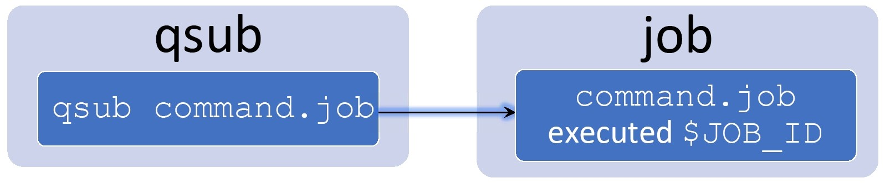
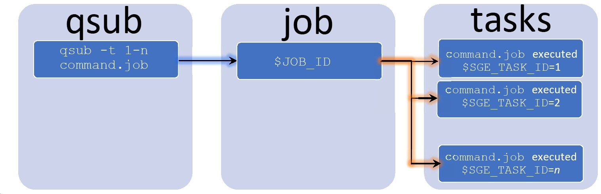

# Using Job Arrays on Hydra (slides, `sh` only)

## In the intro portion of the workshop you will learn:

 * What are job arrays, when and why use them?
 * How to write job arrays scripts.
 * How to submit job arrays: 
   * task range, increment and limit concurrent tasks.
 * Job arrays tips and tricks.
 * Parallel job arrays.
 * How to consolidate small tasks in job arrays.
 * How to manage job arrays:
   * `qstat(+)`, `qdel`, `qalter`, `qacct(+)`.
 * HPC wiki on job arrays:
   * [https://confluence.si.edu/display/HPC/Job+Arrays](https://confluence.si.edu/display/HPC/Job+Arrays) 

---

# Introduction

## What are job arrays, when and why use them?

  * Job arrays allow you to run the same job file multiple times in a single job submission.
  * They are typically used for running a given analysis on different input files or parameters.
  * They allow you to use the same job file and a single `qsub` to run a type of analysis instead of writing a myriad of very similar job files.
  * Job arrays have each a unique job id with multiple task ids
  
---

# How to write job arrays scripts

## A trivial example

  * Job array scripts, or job files, are like any other job file, except that
    they have a task identifier stored in the variable `SGE_TASK_ID`

  * Example:

&nbsp;

```
echo + `date` $JOB_NAME started on $HOSTNAME in $QUEUE \
 with jobID=$JOB_ID and taskID=$SGE_TASK_ID
model < model.$SGE_TASK_ID.inp
echo = `date` $JOB_NAME for taskID=$SGE_TASK_ID done.
```

&nbsp;

&nbsp;&nbsp; this example runs `model` using the input file `model.N.inp`

---

# How to submit job arrays

## That trivial example can be queued on 100 tasks with
```
qsub -t 1-100 trivial_example.job
Your job-array NNNNNN.1-100:1 ("trivial_example.job") has been submitted
```

&nbsp;

&nbsp;&nbsp; this queues one job with 100 tasks, or the equivalent of 100 job files with

```
    model < model.1.inp
```

in `test1.job`

```
    model < model.2.inp
```
in `test2.job`, etc..., up to

```
    model < model.100.inp
```

in `test100.job` - hence one job file instead of 100.

&nbsp;&nbsp;&nbsp; this assumes that you have 100 input files called
`model.1.inp`, `model.2.inp`, ... , `model.100.inp`
  
---

* Regular job: one job file, one job ID



---

* Job array: one job file, one job ID, multiple tasks and task IDs



---

# A more complete job array file

## task range and limit concurrent tasks: `sh` syntax

```
# /bin/sh
#
#$ -N model-100 -cwd -j y -o model.$TASK_ID.log
#$ -t 1-1000 -tc 100
#
echo + `date` $JOB_NAME started on $HOSTNAME in $QUEUE \
 with jobID=$JOB_ID and taskID=$SGE_TASK_ID
#
INPUT=model.$SGE_TASK_ID.inp
OUTPUT=model.$SGE_TASK_ID.out
./model < $INPUT > $OUTPUT
#
echo = `date` $JOB_NAME for taskID=$SGE_TASK_ID done.
```

---

## Note

  * Task range and max concurrent task embedded in the script

```
-t 1-1000 -tc 100
```

  * Different log file and output file for each task

```
-o model.$TASK_ID.log

INPUT=model.$SGE_TASK_ID.inp
OUTPUT=model.$SGE_TASK_ID.out
./model < $INPUT > $OUTPUT
```

  &nbsp;

  * Also:
    * use `$TASK_ID` in embedded `-o` directive 
    * use `$SGE_TASK_ID` in the script

---

# Hands on Part I

   First pause here for 10m 

  * [Hands on Part I markdown](https://github.com/SmithsonianWorkshops/advanced-hydra-workshops/blob/main/job_arrays/job_arrays_hands_on.md)

---

# Job arrays tips and tricks 

## Various ways of using the task id `$SGE_TASK_ID`

  1. formatting trick
  2. using `awk`
  3. using `sed`
  4. using `bc`
  5. using `cd`
  6. using `<<EOF`
  7. using your own tool (sh, csh, awk, perl, python, C, Fortran, ...)

---

## Formatting: replacing 1,2,...,100 by 001,002,...,100

 * `sh` syntax

```
let i=$SGE_TASK_ID
I=$(echo $i | awk '{printf "%3.3d", $1}')
```

---

## Using `awk` to extract parameters from a single file

* `sh` syntax

```
let i=$SGE_TASK_ID
P=$(awk "NR==$i" parameters-list.txt)
```

## &nbsp;

 * the variable `P` will hold the content of the `i`-th line of `parameters-list.txt`, and can be used as:

```
./compute $P
```

  assuming `compute` takes parameters.
     
---

## Using `sed` and a template

 * to replace `NNN` in the template by the task id

## &nbsp;

 * `sh` syntax

```
let i=$SGE_TASK_ID
sed "s/NNN/$i/" input-template.inp > model.$i.inp
model < model.$i.inp > model.$i.out
```

---

## Using `bc` to run models on temperatures grid

  * start at 23.72 and increase by 2.43 increments,
  * replace `TP` by the temperature and `NNN` by the task id

## `sh` syntax

```
let i=$SGE_TASK_ID
tp=$(echo "23.72 + $i*2.43" | bc)
sed -e "s/NNN/$i/" -e "s/TP/$tp/" input-template.inp \
  > model.$i.inp
```

---

## Using `cd` and different directories for each task

  * `sh` syntax

```
let i=$SGE_TASK_ID
cd task.$i
model < model.inp > model.out
```

&nbsp;

&nbsp;&nbsp; assumes there is a `model.inp` file in each `task.N` directory

---

## Using the `<<EOF` construct

  * `sh` syntax

```
let i=$SGE_TASK_ID
tp=$(echo "23.72 + $i*2.43" | bc)
model <<EOF > model.$.out
temp=$tp
EOF
```

---

## Using your own tool, `mytool`, to convert a task id to parameters

  * `sh` syntax

```
i=$SGE_TASK_ID
P=$(./mytool $i)
./compute $P
```

## &nbsp;

* `mytool` can be anything you want:
  * any shell script, awk, perl, python, C, fortran, ... 

---

# How to consolidate small tasks in job arrays.

## Why?

  * Each task is started like a job, hence has the same overhead as starting one job
  * Users should avoid running lots of very short tasks (< 10-30m)
  * It is relatively easy to consolidate short tasks into longer ones, using the task increment:
    * `qsub -t 200-500:20` will run tasks with id=200,220,240,...,500

## How?

 * use the variables:

```
$SGE_TASK_FIRST
$SGE_TASK_LAST
$SGE_TASK_STEPSIZE
$SGE_TASK_ID
```

---

## Example to consolidate short tasks

 * `sh` syntax

```
let iFr=$SGE_TASK_ID
let iTo=$iFr+$SGE_TASK_STEPSIZE-1
if [ $iTo -gt $SGE_TASK_LAST ]; then
  let iTo=$SGE_TASK_LAST
fi
#
echo running model.sh for taskIDs $iFr to $iTo
let i=$iFr
for ((i=$iFr; i<=iTo; i++)); do
  ./model.sh $i >& model.$i.log
done
```

 * assumes that the script `model.sh` do the work and takes one argument: the id.

---

# Parallel job arrays

## Job arrays can run parallel tasks

  * Each task request a parallel environment, as per the `-pe` specification:
     * `-pe mthread N` for multi-threaded
     * `-pe mpich N` or `-pe orte N` for MPI

&nbsp; 

  * Check the HPC wiki for more info 
    at [https://confluence.si.edu/display/HPC/Job+Arrays](https://confluence.si.edu/display/HPC/Job+Arrays)
  
---

# How to manage job arrays

## job status with `qstat` or `qstat+`
  * list task id(s) for running jobs - single job id
  * remaining task range for queued jobs

## job deletion with `qdel`
  * can delete specific tasks w/ `-t` flags
  * otherwise delete all the tasks: running and queued!

---

## job modification with `qalter`
  * supports `-t` and `-tc` flags
  * use `-tc` if and when needed, can be used to increase its value progressively

## job accounting with `qacct` or `qacct+`
  * use `-t` flag to get info on specific task(s)
  * otherwise return info on all the tasks (can be (very) long)

---

# Also remember

## Can run a lot of concurrent tasks
 * separate name spaces
   * some of the tasks will run at the same time
   * should not write in the same file
 * I/O contention:
   * concurrent tasks read the same file(s)?
 * manage the results files
   * esp. if a lot  are created in the same directory
 * test on a small set of tasks first
 * avoid sending emails with `-m abe`
   * it applies to each task (lots of emails).

---

## Resource limits:
    * Limit of 10,000 tasks per job array,
    * Limit of 2,500 jobs per user in the queue, and
    * Limit of 25,000 jobs in the queue (for all users).
 
---

# HPC wiki on job arrays

 * goto [https://confluence.si.edu/display/HPC/Job+Arrays](https://confluence.si.edu/display/HPC/Job+Arrays)

---

# Hands on Part II

  *  First pause here for 10m 
  * [Hands on Part I markdown](https://github.com/SmithsonianWorkshops/advanced-hydra-workshops/blob/main/job_arrays/job_arrays_hands_on.md#hands-on-part-2)

---
